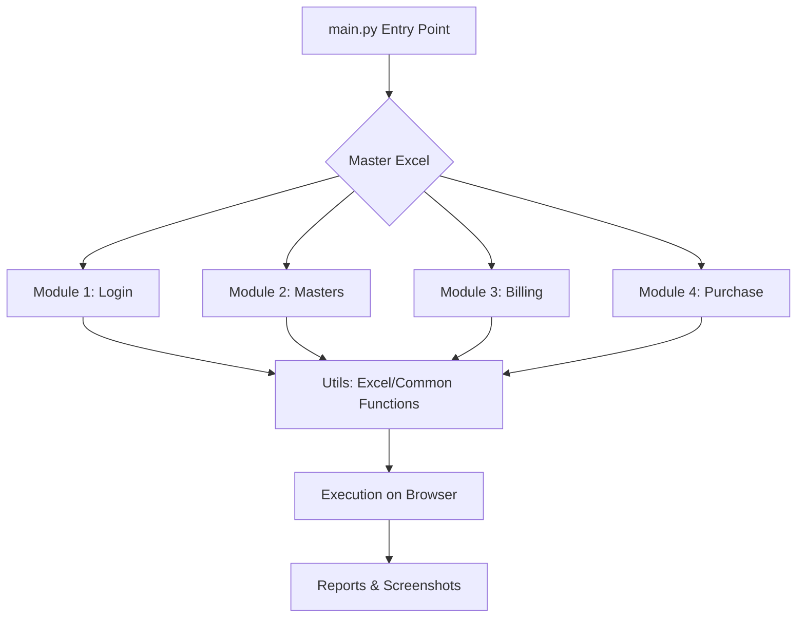

# Sparqla Retail Automation Workflow

This document provides a technical overview of the automation framework designed for retail management systems.

## 🛠 Project Architecture

The framework is built using **Python** and **Selenium WebDriver**, following a modular design that separates configuration, execution logic, and data.

## 📁 Directory Structure

| Directory | Description |
| :--- | :--- |
| `Utils/` | Core drivers: `Excel.py` (data handling), `Function.py` (UI interactions), `Board_rate.py`. |
| `Test_login/`| Authentication modules. |
| `Test_master/` | Setup modules for Metal, Category, Product, Design, etc. |
| `Test_Bill/` | Comprehensive billing automation including Sales, Payment, and Returns. |
| `Test_Purchase/`| GRN (Goods Received Note) and Purchase entry logic. |
| `Reports/` | Automated test execution reports and failure screenshots. |
| `Image_all_Format/`| Reference images or assets used for validation. |

## 🚀 Execution Flow

### 1. Initialization (`main.py`)
- **Environment Setup**: Clears previous screenshots and initializes the Chrome WebDriver with specific options (headless-ready, camera blocking).
- **Master Data Reading**: Reads the `Sqarqla_Retail_data2.xlsx` file to determine which modules are enabled for the current run.

### 2. Module Execution
For each enabled module in the Excel "Master" sheet:
1. The framework instantiates the corresponding class (e.g., `Billing` in `Test_Bill/Bill.py`).
2. It fetches the relevant data sheet from Excel.
3. It iterates through each row, performing the specific UI automation steps.

### 3. Utility Layer (`Utils/`)
- **`ExcelUtils`**: Manages file paths, opens/closes Excel, and provides data mapping for test rows.
- **`Function_Call`**: A wrapper for Selenium commands (click, fill, select) with built-in error handling and screenshot logging.

## 📊 Data Management

The system is entirely **Data-Driven**.
- **Input**: `Sqarqla_Retail_data2.xlsx`
- **Logic**: The code uses `data_map` dictionaries to pair Excel column indices with variable names, allowing for easy updates if the spreadsheet layout changes.
- **Feedback**: Results and remarks are written back to the Excel file in the `ActualStatus` and `Remark` columns.

## 📝 Best Practices for New Modules

1. **Inheritance**: New test classes should inherit from `unittest.TestCase`.
2. **Naming**: Maintain the `Test_[Name]` folder and `[Name].py` file convention.
3. **Wait handling**: Use `WebDriverWait` (centralized in `Function_Call`) instead of hard sleeps.
4. **Error Catching**: Always use `try...except` blocks to ensure the WebDriver closes properly even on failure.

---
*Created on: 2026-01-30*
